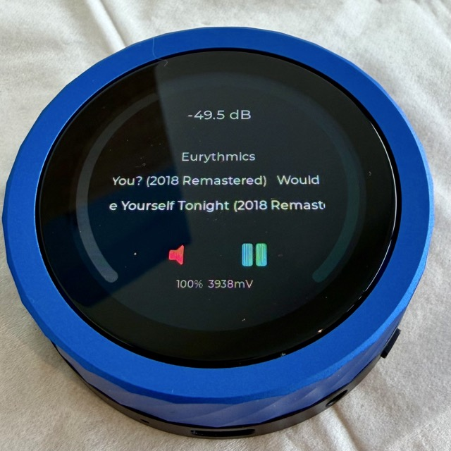

# lyngdorf-knob

<p align="center">
  
</p>

ESP-IDF firmware for the **[Waveshare ESP32-S3-Knob-Touch-LCD-1.8](https://www.waveshare.com/esp32-s3-knob-touch-lcd-1.8.htm?sku=31623)** board, turning it into a physical volume / play-pause / mute controller for **Lyngdorf** amplifiers.

| Interaction | Action |
|---|---|
| Rotate encoder | Volume up / down (default **1.0 dB / detent**, configurable) |
| Tap the speaker icon (left) | Mute / unmute |
| Tap the play/pause icon (right) | Toggle play / pause |

Volume is sent to the amp via Lyngdorf's RIO TCP protocol on port 84 with sub-50 ms latency. The on-screen state mirrors changes made from the Lyngdorf remote, app, or front panel within a few seconds.

---

## Install — no build environment needed

The firmware is published as a pre-built binary you can flash directly from your browser. **Works on Windows, macOS, and Linux** — the ESP32-S3 has a native USB controller, so no drivers are required on any platform.

### 1. Open the installer page

> 👉 **<https://svwhisper.github.io/lyngdorf-knob/>**

You need a **Chromium-based browser**: Chrome, Edge, Brave, Opera, or Vivaldi. Safari and Firefox don't (yet) support the WebSerial API the installer uses.

| If you're on… | Use |
|---|---|
| **Windows** | Edge (preinstalled) or Chrome |
| **macOS** | Chrome, Edge, or Brave (Safari users — install Chrome/Edge for this one step) |
| **Linux** | Chrome, Chromium, Edge, or Brave |

### 2. Plug the device in

Connect the Waveshare board to your computer via USB-C. Both Windows 10/11 and macOS recognise it instantly with no driver install.

> ℹ️ If a serial monitor / IDE on your computer (Arduino IDE, ESP-IDF `idf.py monitor`, PuTTY, etc.) is open on the device's port, **close it first** — only one program can hold the port at a time.

### 3. Click *Install*

On the installer page, click the **Install lyngdorf-knob** button. A serial-port picker opens — choose the device (it'll be labelled something like `USB JTAG/serial debug unit (COM5)` on Windows, `/dev/cu.usbmodem…` on macOS).

Flashing takes about 30 seconds. The browser shows progress; the device displays nothing during this phase.

### 4. First-boot WiFi setup

When flashing completes the device reboots, shows a brief boot splash with a QR code, and then comes up needing WiFi credentials.

1. With your phone or laptop, look for a WiFi network called **`LyngdorfKnob`** and connect to it (it's open, no password).
2. Open a browser and visit **<http://192.168.4.1>**.
3. Fill in the form:

   | Field | What to put |
   |---|---|
   | **WiFi SSID** | Your home network name |
   | **WiFi Password** | Your home network password |
   | **Amp IP** | The Lyngdorf TDAI-3400's IP address — set a DHCP reservation in your router so it doesn't change |
   | **Vol Step** | Leave at `10` for 1.0 dB per click. Use `5` for 0.5 dB / `15` for 1.5 dB / etc. |
   | **Track-info refresh** | Leave at `3` (seconds) |
   | **Dim display after** | Seconds idle before display dims (default 30, `0` = never) |
   | **Sleep display after** | Seconds idle before display fully sleeps (default 120, `0` = never) |

4. Click **Save**. The device reboots, joins your home WiFi, connects to the amp, and is ready to use.

After this, the same config form is available at `http://<device's-IP>/` whenever you're on the same network — for changing settings or the amp's IP.

### Troubleshooting

| Symptom | Try |
|---|---|
| Browser says "this site requires WebSerial" | You're on Safari / Firefox. Switch to Chrome / Edge / Brave for the install step only. |
| Device not in the serial-port picker | Close any other program holding the port (Arduino IDE, terminal monitor); unplug + replug the USB cable; try a different USB port. |
| "Failed to connect" / "MD5 mismatch" mid-flash | Use a USB cable that supports data (cheap charging-only cables are common); try a directly-connected USB port instead of a hub. |
| Display stays blank after flashing | The device might be in AP mode waiting for WiFi config — look for the `LyngdorfKnob` WiFi network. |
| Can't find `LyngdorfKnob` WiFi | Power-cycle the device. The AP appears within 5 seconds of boot if no WiFi is configured. |

### Viewing logs over the network

The device keeps an in-memory ring buffer of its recent log output (~8 KB, roughly the last 100–150 lines) and exposes it over HTTP at:

> **`http://<device-ip>/log`**

This is useful when the device is on battery — there's no USB-CDC monitor to attach, but you can still see what it's doing.

Open it in a browser (refresh for updates), or from a terminal:

```bash
# Show current log buffer once
curl -s http://192.168.3.214/log

# Live tail — refresh every 2 seconds, last 30 lines
while true; do clear; curl -s http://192.168.3.214/log | tail -30; sleep 2; done
```

The same log output goes to USB-CDC when a cable is connected, so you don't lose anything by using one or the other.

### Manual flash (advanced fallback)

If you can't or won't use a Chromium browser, you can flash from the command line:

```bash
# Install esptool (one-time)
pip install esptool

# Download the merged firmware from the latest release
curl -LO https://github.com/svwhisper/lyngdorf-knob/releases/latest/download/lyngdorf-knob-merged.bin

# Flash it (replace the port for your OS)
#   macOS / Linux:  /dev/cu.usbmodem* or /dev/ttyUSB0
#   Windows:        COM5  (check Device Manager for the actual port)
esptool.py --chip esp32s3 -p /dev/cu.usbmodem* write_flash 0x0 lyngdorf-knob-merged.bin
```

After flashing, the same first-boot WiFi setup applies.

---

## Display layout (360 × 360 round LCD)

```
                –NN.N dB        ← always-visible volume readout (top)
                Artist
                Track Title
                Album
                🔊  ▶          ← tappable mute & play/pause icons
                  NN%           ← battery percentage
                status line     ← WiFi / amp connection
```

- **Volume arc** — 270° teal ring around the perimeter, dims when muted
- **Numeric volume** — top of display, always visible, updates live during rotation
- **Track info** — artist / title / album, three centered lines (Montserrat 16pt white), pulled from the amp's HTTP/JSON API every 3 s
- **Icons** — speaker (🔊 teal / 🔇 red) and play/pause (▶ / ⏸ teal), 32 pt, tap to toggle
- **Battery** — small (12pt) percentage below the icons, gray when ≥21%, red when ≤20%
- **Idle** — display dims after `dim_secs` of inactivity, then panel-sleeps after `sleep_secs`. Any rotation or touch wakes instantly. After a further 5 minutes idle (and the amp not playing) the device drops into **deep sleep** — wake by **rotating the knob** (touch is disabled in deep sleep so the touch controller can fully power down).
- **Haptic** — DRV2605 LRA buzz on every icon tap (encoder uses its mechanical detents; no electronic haptic on rotation)

### Boot splash

On boot the project name appears at the top with a QR code linking to this repo (`https://github.com/svwhisper/lyngdorf-knob`) below it. Held for 6 seconds, then fades over 1 second to reveal the regular UI. Long enough to scan with a phone — the QR has a 6 px white quiet-zone border so cameras lock on quickly.

## Hardware

| Part | Detail |
|---|---|
| MCU | ESP32-S3 (240 MHz, 16 MB flash, 8 MB PSRAM) |
| Display | SH8601 360×360 round LCD over QSPI ([not ST77916 despite some docs](#hardware-quirks)) |
| Touch | CST816D capacitive over I2C (port 0) |
| Encoder | Switch-style, two GPIOs ([not standard quadrature](#hardware-quirks)) |
| Haptic | DRV2605 LRA driver over I2C (shared bus with touch) |
| Battery | Li-Po, voltage on ADC1 ch0 (GPIO 1) via 2× divider |
| WiFi | 2.4 GHz 802.11 b/g/n |

### Pin assignments

| Function | GPIO | | Function | GPIO |
|---|---:|---|---|---:|
| LCD CLK | 13 | | Touch SDA | 11 |
| LCD CS | 14 | | Touch SCL | 12 |
| LCD D0..D3 | 15..18 | | Encoder A | 8 |
| LCD RST | 21 | | Encoder B | 7 |
| LCD Backlight | 47 | | | |

## Architecture

### Three FreeRTOS tasks

| Task | Core | Pri | Stack | Purpose |
|---|---:|---:|---:|---|
| `ui` | 1 | 3 | 20 KB | LVGL render loop, encoder + touch event drain |
| `net` | 0 | 2 | 12 KB | Lyngdorf RIO TCP (port 84): VOL/MUTE poll & cmds |
| `metadata` | 0 | 1 | 8 KB | HTTP/JSON poll of amp:8080/api/getData |

The metadata task is deliberately on its own task at lower priority than `net_task`, so the HTTP fetch (~100–500 ms) never delays encoder commands.

### Files

```
main/main.c            — app_main(), ui_task, net_task
main/display.c/h       — SH8601 QSPI init, LVGL flush callback, backlight PWM
main/esp_lcd_sh8601.c/h — local SH8601 panel driver (extracted from Waveshare demo)
main/touch.c/h         — CST816D I2C driver, region-aware tap dispatch
main/encoder.c/h       — 3 ms GPIO poll, switch-style decode → command queue
main/lyngdorf.c/h      — RIO TCP socket, !VOL?/!MUTE? poll, !VOLCH(N) / !MUTE(ON|OFF)
main/metadata.c/h      — esp_http_client + cJSON track-info fetch + play/pause toggle
main/ui.c/h            — LVGL widgets: arc, vol/artist/title/album labels, icons
main/power.c/h         — dim/sleep timers, activity signalling
main/haptic.c/h        — DRV2605 LRA driver, single-effect playback
main/battery.c/h       — ADC1 ch0 oneshot + curve-fit cali, 10 s periodic poll
main/wifi_manager.c/h  — STA mode with AP fallback after 5 failed retries
main/web_server.c/h    — HTTP config form at http://<device-ip>/
main/app_config.c/h    — NVS get/set, shared lk_state_t, g_state_mutex, g_cmd_queue
```

## Amp protocol

### RIO over TCP (port 84) — used for volume and mute

ASCII commands, `\r`-terminated. The amp echoes back with `#` and replies with `!`.

| TX | Effect | RX format |
|---|---|---|
| `!VOLCH(n)` | Change volume by *n* tenths of a dB | (no reply) |
| `!VOL?` | Query current volume | `!VOL(-300)` = −30.0 dB |
| `!MUTE(ON)` / `!MUTE(OFF)` | Set mute on/off | (no reply) |
| `!MUTE?` | Query mute state | `!MUTE(ON)` or `!MUTE(OFF)` |

The firmware sends a single coalesced `!VOLCH(N)` per net_task drain cycle, summing all queued encoder ticks — so a fast rotation doesn't flood the amp.

### HTTP JSON API (port 8080) — used for track info and play/pause

```
GET /api/getData?path=player:player/data&roles=title,mediaData,value
GET /api/setData?path=player:player/control&roles=activate&value={"control":"pause"}
```

The first returns a JSON array; the payload object is the first element with a `trackRoles` key. The firmware extracts `state` ("playing" / "paused"), `trackRoles.title`, and `trackRoles.mediaData.metaData.{artist,album}`.

The second is a toggle — same URL whether currently playing or paused; the amp picks the right direction.

## Building from source

If you want to modify the firmware or are developing on top of it.

### Prerequisites
- [ESP-IDF 5.2+](https://docs.espressif.com/projects/esp-idf/en/stable/esp32s3/get-started/)
- Python 3.9+

### Build & flash

```bash
cd lyngdorf-knob
idf.py set-target esp32s3
idf.py build
idf.py -p /dev/tty.usbmodem* flash monitor
```

The component manager auto-fetches `lvgl/lvgl 8.3.x` and `espressif/esp_lcd_touch`. The SH8601 driver and cJSON are bundled (cJSON via the `json` IDF component).

### Cutting a release

Tag the commit you want to release and push the tag — a GitHub Actions workflow builds the firmware, attaches the merged binary to a GitHub Release, and updates `docs/manifest.json` so the install page picks up the new version.

```bash
git tag v1.0.0 && git push origin v1.0.0
```

## Hardware quirks

Things this firmware learned the hard way; useful if you're forking or adapting:

- **The display chip is SH8601, not ST77916.** Some references / Waveshare docs say ST77916 — the ST77916 driver partially works (display lights up) but pixels render as hash. The local `esp_lcd_sh8601` driver with Waveshare's exact 180-cmd init sequence is required.
- **The encoder is *not* a quadrature encoder.** It's two independent switches: rests at `0b11`; one direction pulses A low (`0b11→0b01→0b11`), the other pulses B low (`0b11→0b10→0b11`). Don't try to gray-code-decode it — direction is just "which line went low".
- **Backlight PWM must be ≥ ~25 kHz.** 5 kHz aliases against the LCD scan and produces visible horizontal beat bands. Currently 50 kHz.
- **Lyngdorf mute syntax is `!MUTE(ON)` / `!MUTE(OFF)`** — not `!MUTE` / `!UNMUTE` and not `!MUTEON` / `!MUTEOFF`. Both query and set commands use the parenthesised form.
- **The amp does not expose UPnP.** Don't add SSDP/AVTransport code; use the HTTP/JSON API on port 8080 instead.
- **The amp's HTTP server uses chunked transfer encoding.** `Content-Length` is absent; read until EOF.
- **JSON response shape:** top-level array; the payload is the first array element that's an object with a `trackRoles` key. There is no `"player:player/data"` marker string between the placeholder slots and the payload, despite what some references claim.

## License / acknowledgements

The local `esp_lcd_sh8601.c` / `.h` are extracted from Waveshare's official Arduino demo for this board (Espressif Apache-2.0 origin). Everything else under MIT.
